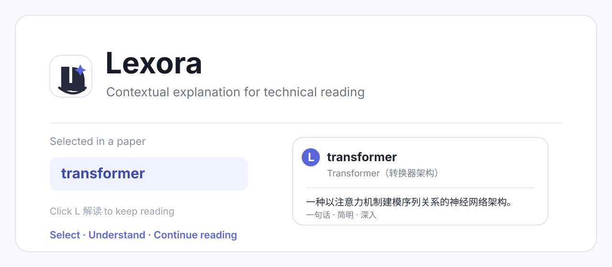
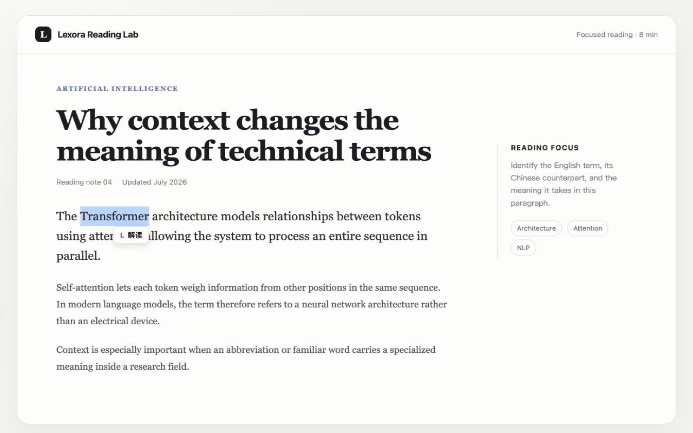
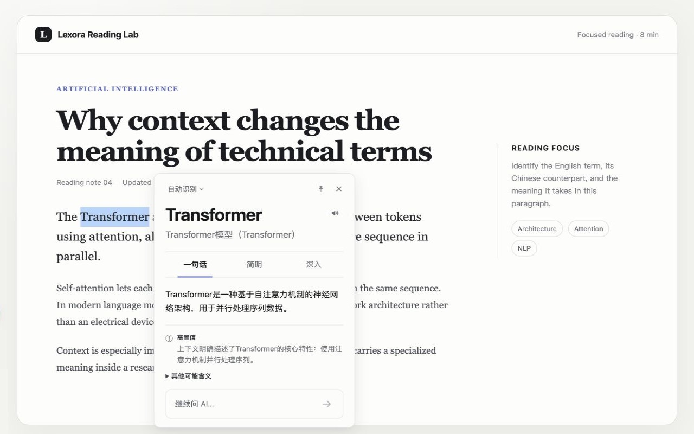
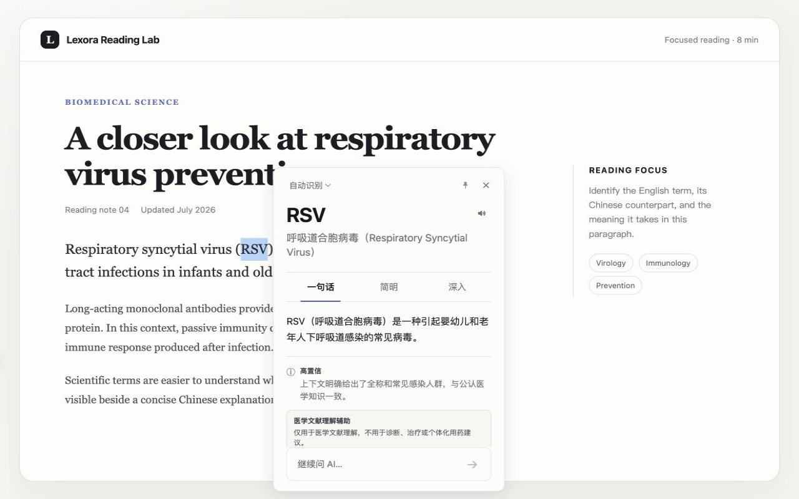

<p align="center">
  
</p>

<h1 align="center">Lexora</h1>

<p align="center"><strong>Read a technical term in context — without leaving the page.</strong></p>

<p align="center">
  A select-to-explain extension for medical and AI reading: contextual interpretation, not bare translation.
</p>

<p align="center">
  <a href="https://github.com/Zsl-w/Lexora/releases/tag/v0.8.7"></a>
  <a href="LICENSE"></a>
  
</p>

<p align="center">
  <a href="https://github.com/Zsl-w/Lexora/releases/download/v0.8.7/lexora-extension-0.8.7-chrome.zip"></a>
</p>

<p align="center">
  <a href="README.md">简体中文</a> · English · <a href="https://temporalsync.online/lexora">Product page</a>
</p>

<p align="center">
  
</p>

---

## Why Lexora?

When reading a paper, the difficult part is often not translating a word but understanding what it means *here*. Does `AD` refer to a disease in this paragraph? Is `transformer` an architecture, a model, or a named method from a particular paper?

Lexora gives a **contextual explanation** after selection: understand the essentials quickly, then choose whether to go deeper or inspect sources.

## Core experience

| Select and explain | Fast first, deep on demand | Bilingual mapping |
| :---: | :---: | :---: |
| Select a term, acronym, phrase, sentence, or several keywords, then click **L 解读**. | A one-line answer and concise explanation appear first; open deeper interpretation only when needed. | Keep the original English term and Chinese name together. |

| Continue the conversation | Sources when needed | Stay in the reading flow |
| :---: | :---: | :---: |
| Ask follow-up questions in the compact window without losing selection context. | Deeper interpretation searches PubMed, arXiv, and Crossref by topic. | Drag or pin the window; when unpinned, it gets out of the way after focus leaves it. |

## See it in use

<p align="center">
  
</p>

<p align="center">
  
  
</p>

## Get started

Lexora is a Chrome browser extension. Download the package to use it while reading webpages and HTML papers.

<p align="center">
  <a href="https://github.com/Zsl-w/Lexora/releases/download/v0.8.7/lexora-extension-0.8.7-chrome.zip"><strong>↓ Download v0.8.7</strong></a>
  &nbsp;·&nbsp;
  <a href="https://github.com/Zsl-w/Lexora/releases/tag/v0.8.7">Release notes</a>
</p>

## Model, cost, and privacy boundary

Lexora uses the reader's own DeepSeek API key. The key is stored in browser extension storage and is not exposed to ordinary webpages; requests are sent by the extension background process.

The current build uses `deepseek-v4-flash`. A fast answer is requested on the normal reading path. Source searching and deeper interpretation begin only after the reader chooses **深入**, reducing wait time and API use.

## Medical-content boundary

Lexora supports terminology reading and learning. It does **not** diagnose conditions, recommend treatment, prescribe medication, or give individual dosing advice. Medical explanations may be incomplete or uncertain and must not replace clinical judgement.

## Recovery status and local development

The original WXT/TypeScript source tree was accidentally deleted. This repository preserves a functional v0.8.7 recovery baseline:

```text
extension-baseline/       Functional recovered extension baseline
scripts/                  Build and verification scripts
docs/images/              README product screenshots
```

```bash
npm run verify
npm run build
```

The rebuilt extension is written to `.output/recovered-chrome-mv3/`; the original release artifact is never overwritten. Future work will gradually replace the recovered bundle with readable modules while verifying behavior against v0.8.7.

## Feedback

Lexora is in public beta. If an abbreviation is interpreted incorrectly, a site does not show the selection entry, or a deeper explanation is not useful, please [open an issue](https://github.com/Zsl-w/Lexora/issues).

Built by [十月七 · TemporalSync](https://temporalsync.online/).

## License

Lexora-owned source and documentation in this repository are licensed under the [Apache License 2.0](LICENSE). Third-party components remain subject to their own licenses.
